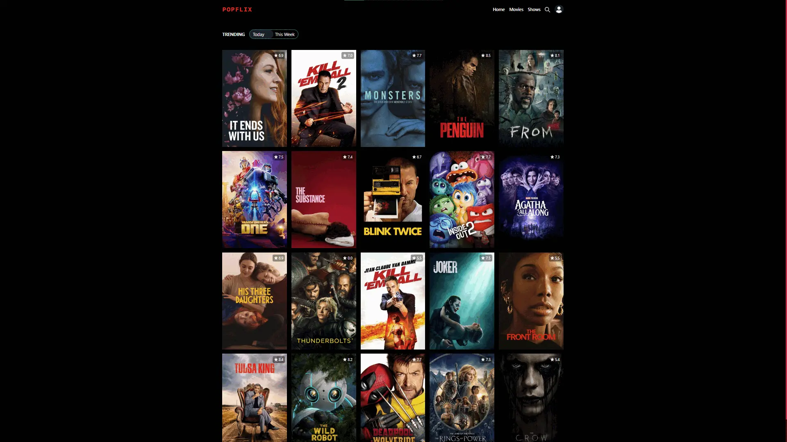

<div align="center">

# 🎬 Popflix

[](https://your-project-url.pages.dev)
[](https://nextjs.org/)
[](https://www.typescriptlang.org/)
[](https://react.dev/)
[](https://chakra-ui.com/)
[](https://firebase.google.com/)

### **[🔗 Popflix](https://your-project-url.pages.dev)**



### Popflix is a modern, feature-rich movie and TV show discovery SPA

Built with Next.js 14, TypeScript, and powered by The Movie Database (TMDB) API. Browse trending content, search for your favorite movies and shows, create your personal watchlist, and explore detailed information about actors and productions, watch trailers, login & bookmark contents.

</div>

---

## ✨ Features

- **🔥 Trending Content**: Browse daily and weekly trending movies and TV shows
- **🎥 Discover**: Explore extensive collections of movies and TV series with sorting options
- **🔍 Smart Search**: Real-time search with debouncing for movies, TV shows, and people
- **📺 Detailed Information**: View comprehensive details including:
  - Cast and crew information
  - Trailers and video content
  - High-quality posters and backdrops
  - Release dates, ratings, and overviews
- **👤 Person Profiles**: Explore actor/actress profiles with their filmography and images
- **📝 Personal Watchlist**: Save your favorite content (requires authentication)
- **🔐 Authentication**: Secure Google sign-in powered by Firebase
- **📱 Responsive Design**: Fully responsive UI optimized for all devices
- **🎨 Modern UI**: Beautiful interface built with Chakra UI and Framer Motion animations
- **⚡ Fast Performance**: Powered by Next.js with Turbopack for blazing-fast development

## 🛠️ Tech Stack

### Frontend
- **[Next.js](https://nextjs.org/)** (latest) - React framework with App Router
- **[React 18](https://react.dev/)** - UI library
- **[TypeScript](https://www.typescriptlang.org/)** - Type safety
- **[Chakra UI](https://chakra-ui.com/)** - Component library
- **[Framer Motion](https://www.framer.com/motion/)** - Animation library

### Backend & Services
- **[Firebase Auth](https://firebase.google.com/)** - Authentication
- **[Firestore](https://firebase.google.com/docs/firestore)** - Database for watchlist
- **[TMDB API](https://www.themoviedb.org/documentation/api)** - Movie and TV data

### Development
- **[Turbopack](https://turbo.build/pack)** - Fast bundler
- **[Axios](https://axios-http.com/)** - HTTP client
- **[Zod](https://zod.dev/)** - Schema validation

## 🚀 Getting Started

### Prerequisites

- Node.js 18+ installed
- A TMDB API key ([Get one here](https://www.themoviedb.org/settings/api))
- A Firebase project ([Create one here](https://console.firebase.google.com/))

### Installation

1. **Clone the repository**
   ```bash
   git clone https://github.com/yourusername/popflix.git
   cd popflix
   ```

2. **Install dependencies**
   ```bash
   npm install
   # or
   yarn install
   # or
   pnpm install
   ```

3. **Set up environment variables**
   
   Create a `.env.local` file in the root directory:
   ```env
   NEXT_PUBLIC_TMDB_KEY=your_tmdb_api_key_here
   NEXT_PUBLIC_FIREBASE_API_KEY=your_firebase_api_key
   NEXT_PUBLIC_FIREBASE_AUTH_DOMAIN=your_project.firebaseapp.com
   NEXT_PUBLIC_FIREBASE_PROJECT_ID=your_project_id
   NEXT_PUBLIC_FIREBASE_STORAGE_BUCKET=your_project.appspot.com
   NEXT_PUBLIC_FIREBASE_MESSAGING_SENDER_ID=your_sender_id
   NEXT_PUBLIC_FIREBASE_APP_ID=your_app_id
   ```

4. **Run the development server**
   ```bash
   npm run dev
   # or
   yarn dev
   # or
   pnpm dev
   ```

5. **Open your browser**
   
   Navigate to [http://localhost:3000](http://localhost:3000)

## 📁 Project Structure

```
popflix/
├── app/                      # Next.js App Router pages
│   ├── info/[...slug]/      # Movie/Show details pages
│   ├── movies/              # Movies discovery page
│   ├── shows/               # TV shows discovery page
│   ├── search/              # Search page
│   ├── person/[id]/         # Person/Actor details page
│   ├── watchlist/           # User watchlist (protected)
│   ├── profile/             # User profile (protected)
│   └── page.tsx             # Home page (trending)
├── components/              # Reusable components
│   ├── DetailsPage/         # Detail page components
│   ├── HOC/                 # Higher-order components
│   └── ...                  # UI components
├── context/                 # React context providers
│   ├── authProvider.tsx     # Authentication context
│   └── useAuth.ts           # Auth hook
├── hooks/                   # Custom React hooks
├── services/                # API and Firebase services
│   ├── api.ts              # TMDB API calls
│   ├── firebase.ts         # Firebase config
│   └── firestore.ts        # Firestore operations
├── utils/                   # Utility functions and types
└── public/                  # Static assets
```

## 🎯 Key Features Explained

### Authentication & Watchlist
- Users can sign in with their Google account
- Authenticated users can add movies/shows to their personal watchlist
- Watchlist data is stored in Firebase Firestore
- Protected routes ensure only authenticated users can access watchlist features

### Search Functionality
- Real-time search with debouncing for optimal performance
- Search across movies, TV shows, and people
- Pagination support for large result sets
- URL-based search parameters for shareable links

### Content Discovery
- Browse trending content with daily/weekly toggle
- Discover movies and TV shows with various sorting options
- View detailed information including cast, crew, and trailers
- High-resolution images and posters

## 🔑 API Integration

The app integrates with [The Movie Database (TMDB) API](https://www.themoviedb.org/documentation/api) to fetch:
- Trending content
- Movie and TV show details
- Search results
- Person/actor information
- Video trailers
- Images and posters

## 🎨 UI/UX Features

- **Dark Mode**: Elegant dark theme optimized for movie browsing
- **Smooth Animations**: Powered by Framer Motion
- **Loading States**: Skeleton screens for better UX
- **Toast Notifications**: User feedback for actions
- **Responsive Grid Layouts**: Optimized for all screen sizes


## 📧 Contact

For any questions or feedback, feel free to reach out!

---

**Built with ❤️ using Next.js and TypeScript**
